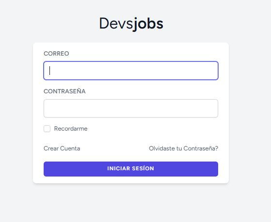
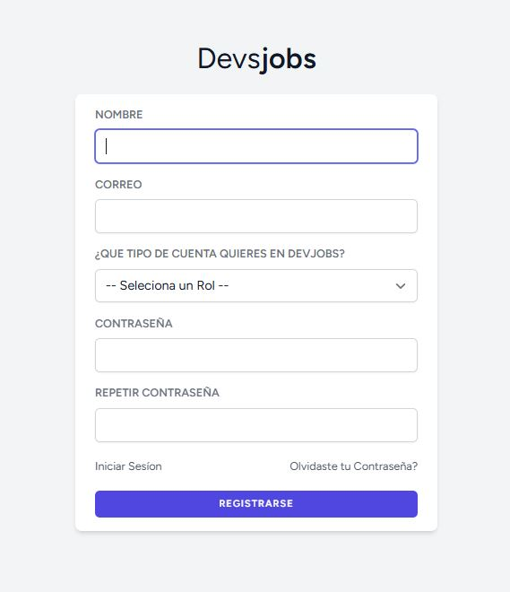
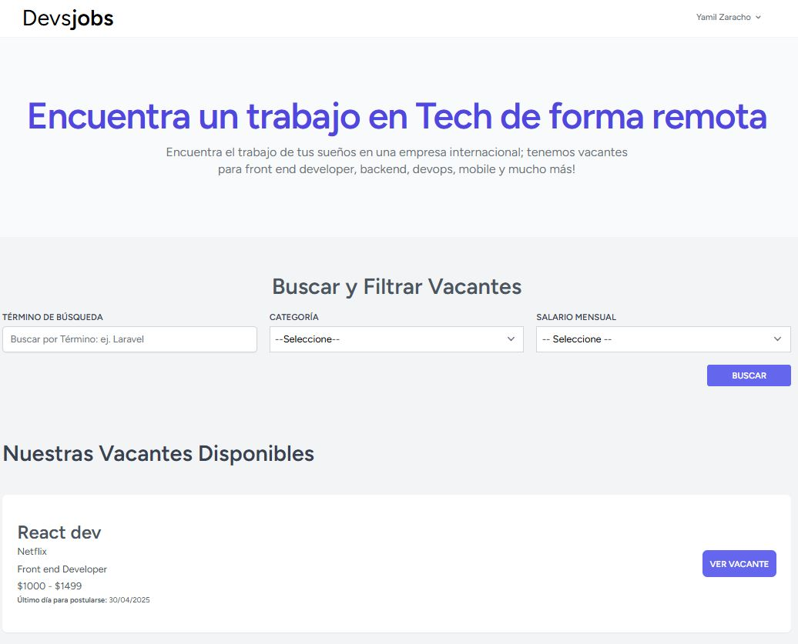
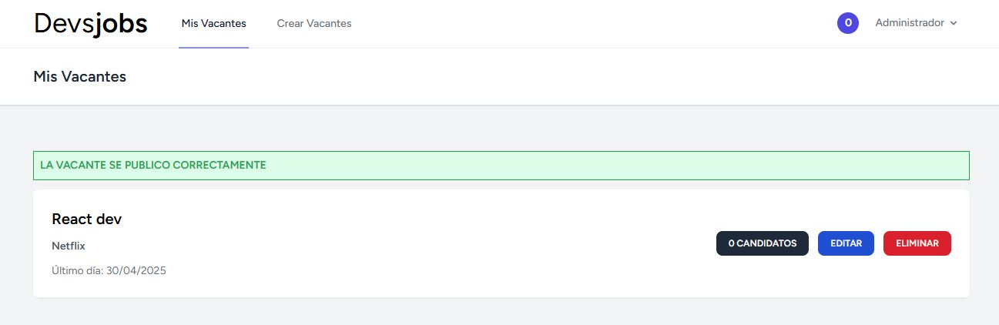
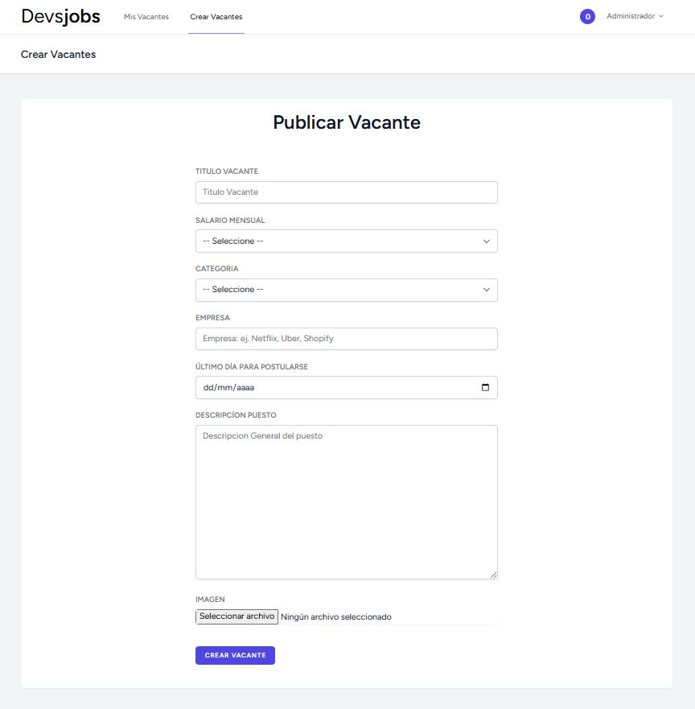
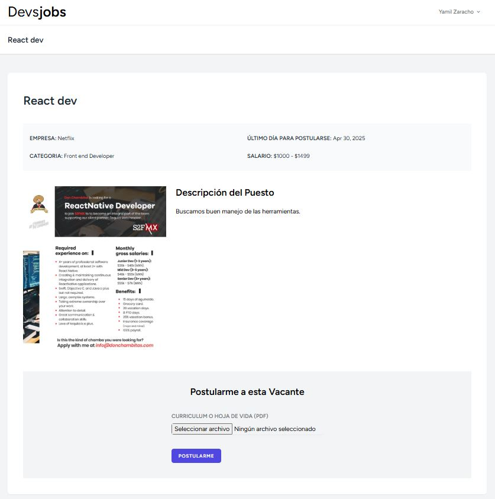
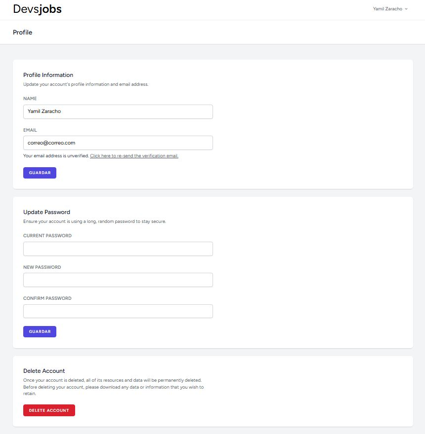

# 💼 DevJobs

DevJobs es una plataforma donde empresas pueden publicar ofertas laborales para desarrolladores, y postulantes pueden buscar empleos, aplicar y ver detalles de cada vacante.

---

## 🚀 Tecnologías Utilizadas

- 🧬 PHP 8+
- ⚙️ Laravel 11
- ⚡ Livewire
- 💾 MySQL
- 🎨 Tailwind CSS
- 🔐 Autenticación con Laravel Breeze
- 🧠 Eloquent ORM
- 📦 Composer y NPM

---

## 📋 Requisitos Previos

- PHP 8.1 o superior
- Composer
- Node.js y NPM
- MySQL o MariaDB
- Extensiones PHP necesarias (`pdo`, `mbstring`, `openssl`, etc.)

---

## 🖼️ Capturas de Pantalla

### 🔑 Página de Login


### 📝 Página de Registro


### 🏠 Página Principal


### 📋 Página de Vacantes


### ➕ Crear Vacante


### 👁️ Ver Detalle de Vacante


### ⚙️ Configuración de Perfil


### 📧 Verificación de Cuenta


---

### ⚙️ Funcionalidades
- Registro e inicio de sesión de empresas y candidatos
- Publicación y gestión de vacantes
- Subida de CV
- Buscador de empleos
- Aplicación de candidatos a vacantes
- Componente dinámico con Livewire

---

### 📁 Estructura del Proyecto (Resumen)
app/
├── Http/
│   ├── Controllers/
│   └── Livewire/
resources/
├── views/
├── css/
├── js/
routes/
└── web.php
.env.example
public/
database/

---

### 💡 Autor
Desarrollado por Yamil G. Zaracho R. (YamilGZ).

---

## 📥 Instalación y configuración

```bash
# 1. Clona el repositorio
git clone https://github.com/YamilGZ/laravel-devjobs.git

cd laravel-devjobs

# 2. Instala dependencias PHP
composer install

# 3. Instala dependencias de JS/CSS
npm install && npm run dev

# 4. Copia archivo de entorno
cp .env.example .env

# 5. Genera la clave
php artisan key:generate

# 6. Crea base de datos y configura el archivo .env
DB_DATABASE=devjobs
DB_USERNAME=tu_usuario
DB_PASSWORD=tu_password

# 7. Ejecuta migraciones
php artisan migrate

# 8. Ejecuta los Seeders
php artisan db:seed

# 9. Ejecuta la creacion de acceso directo de storage en public
php artisan storage:link

# 10. Arranca el servidor
php artisan serve
